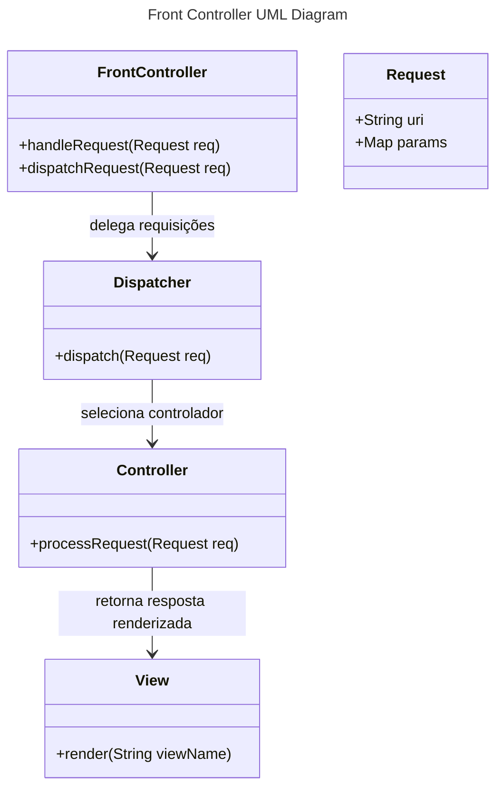

# Padrão estrutural Front Controller

## Intenção
O **Front Controller** tem como objetivo centralizar o controle de todas as requisições de uma aplicação web. Ele atua como um ponto único de entrada, permitindo que processos comuns (como autenticação, autorização, logging e tratamento de erros) sejam aplicados de forma centralizada, sem a necessidade de repetição em cada controlador individual.

## Também conhecido como
Front Controller

## Motivação
Em aplicações web, a manipulação das requisições pode ficar dispersa, com cada controlador implementando suas próprias rotinas de pré-processamento (ex.: autenticação e logging). Essa dispersão gera redundância e dificulta a manutenção e a evolução do sistema. O Front Controller resolve esse problema ao concentrar essas funções comuns em um único ponto de entrada, delegando o processamento específico para outros componentes conforme necessário.

## Aplicabilidade
Utilize o padrão Front Controller em sistemas web que demandem:
- Centralização do controle de requisições;
- Aplicação uniforme de políticas de segurança, logging e tratamento de erros;
- Facilidade para alterar o fluxo de processamento sem modificar cada controlador individualmente.

## Aplicação
Imagine uma aplicação web onde todas as requisições do usuário passam por uma única porta de entrada. Ao receber uma requisição, o Front Controller executa procedimentos iniciais, como verificação de autenticação e logging. Em seguida, ele encaminha a requisição para o **Dispatcher**, que, com base na URI da requisição, seleciona o **Controller** adequado (por exemplo, um `UserController` para requisições de usuário ou um `DefaultController` para requisições não mapeadas). Após o processamento pelo controlador, uma **View** é escolhida para renderizar a resposta final que será enviada ao cliente.

## Estrutura
A seguir, um diagrama UML em mermaid que ilustra a estrutura básica do padrão Front Controller para o cenário descrito:



## Participantes
1. **FrontController**  
   *Ponto de entrada único da aplicação.*  
   Recebe todas as requisições, realiza pré-processamentos (como autenticação e logging) e delega o controle para o Dispatcher.

2. **Dispatcher**  
   *Componente responsável por gerenciar o roteamento das requisições.*  
   Seleciona o controlador adequado com base na URI ou outros parâmetros da requisição.

3. **Controller**  
   *Componente que contém a lógica de negócio específica.*  
   Processa a requisição delegada e retorna o nome ou dados da view que deve ser renderizada.

4. **View**  
   *Componente de apresentação da resposta.*  
   Renderiza a resposta final (HTML, JSON, etc.) a ser enviada de volta ao cliente.

5. **Request**  
    *Representação da requisição HTTP.*  
    Armazena informações como URI, parâmetros e cabeçalhos, que serão utilizados pelo FrontController e seus colaboradores.

## Código Java
A seguir, um exemplo em Java demonstrando o funcionamento do padrão Front Controller:

```java
// Classe principal que atua como ponto de entrada para as requisições
public class FrontController {
    private Dispatcher dispatcher;

    // Construtor inicializa o Dispatcher responsável pelo roteamento
    public FrontController() {
        dispatcher = new Dispatcher();
    }

    // Método que recebe e processa a requisição inicial
    public void handleRequest(Request request) {
        // Pré-processamento: autenticação, logging, etc.
        System.out.println("FrontController: Processando a requisição para " + request.getUri());
        
        // Delegação para o Dispatcher para encaminhar a requisição ao controlador correto
        dispatcher.dispatch(request);
    }
}

// Classe responsável por encaminhar a requisição para o controlador adequado
public class Dispatcher {
    // Método que seleciona o controlador com base na URI da requisição
    public void dispatch(Request request) {
        String uri = request.getUri();
        Controller controller;

        // Seleção simples do controlador: se for "/user" utiliza UserController, senão usa DefaultController
        if (uri.equalsIgnoreCase("/user")) {
            controller = new UserController();
        } else {
            controller = new DefaultController();
        }
        
        // Processa a requisição no controlador selecionado
        String viewName = controller.processRequest(request);
        
        // Instancia a View para renderizar a resposta final
        View view = new View();
        view.render(viewName);
    }
}

// Interface que define o contrato para os controladores
public interface Controller {
    // Método que processa a requisição e retorna o nome da view
    String processRequest(Request request);
}

// Controlador específico para requisições de usuário
public class UserController implements Controller {
    @Override
    public String processRequest(Request request) {
        System.out.println("UserController: Processando requisição do usuário.");
        // Lógica de negócio específica para usuários
        return "userView";
    }
}

// Controlador padrão para requisições não mapeadas
public class DefaultController implements Controller {
    @Override
    public String processRequest(Request request) {
        System.out.println("DefaultController: Processando requisição padrão.");
        // Lógica para requisições sem um controlador específico
        return "defaultView";
    }
}

// Classe que representa a View responsável por renderizar a resposta
public class View {
    // Método para renderizar a view final
    public void render(String viewName) {
        System.out.println("View: Renderizando a view " + viewName);
    }
}

// Classe que representa a requisição HTTP
public class Request {
    private String uri;
    // Outros atributos como parâmetros e cabeçalhos podem ser adicionados conforme necessário

    public Request(String uri) {
        this.uri = uri;
    }

    public String getUri() {
        return uri;
    }
}
```

> **Comentários principais do código:**  
> - **FrontController:** Centraliza o recebimento e pré-processamento das requisições.  
> - **Dispatcher:** Encaminha a requisição para o controlador apropriado com base na URI.  
> - **Controller:** Implementa a lógica de negócio específica para cada tipo de requisição.  
> - **View:** Responsável por renderizar a resposta final para o usuário.

## Colaborações
O **Front Controller** colabora estreitamente com os demais componentes:
- **FrontController → Dispatcher:** Recebe a requisição e delega a responsabilidade de roteamento.
- **Dispatcher → Controller:** Seleciona e invoca o controlador adequado para tratar a requisição.
- **Controller → View:** Após processar a lógica de negócio, o controlador retorna informações que serão renderizadas pela View.

Essa colaboração garante que as funcionalidades transversais (autenticação, logging, etc.) sejam centralizadas, enquanto o processamento específico é distribuído entre controladores especializados.

## Consequências
**Vantagens:**
- **Centralização:** Facilita a implementação de funcionalidades transversais, como segurança e logging.
- **Manutenção:** Permite alterações no fluxo de requisições de forma centralizada, sem necessidade de alterar cada controlador individualmente.
- **Escalabilidade:** Torna o sistema mais modular e preparado para expansões futuras.

**Desvantagens:**
- **Complexidade Inicial:** A implementação do Front Controller pode adicionar complexidade extra na fase inicial do desenvolvimento.
- **Ponto Único de Falha:** Se não for bem projetado, o Front Controller pode se tornar um gargalo ou ponto único de falha na aplicação.

## Usos conhecidos
O padrão Front Controller é amplamente utilizado em frameworks e aplicações web modernas. Exemplos notáveis incluem:
- **Spring MVC (Java):** Utiliza um Front Controller central (DispatcherServlet) para gerenciar todas as requisições.
- **Struts (Java):** Implementa um Front Controller para direcionar o fluxo de requisições.
- **ASP.NET MVC:** Centraliza o tratamento de requisições utilizando um controlador central.

## Padrões relacionados
- **Command (Comportamental):** Para encapsular requisições como objetos, facilitando a execução e o desacoplamento.
- **Strategy (Comportamental):** Para selecionar dinamicamente o controlador adequado com base na requisição.
- **Singleton (Criacional):** Pode ser usado para garantir que componentes críticos, como o Dispatcher, tenham apenas uma instância.
- **MVC (Arquitetural):** O padrão Front Controller é frequentemente utilizado como parte da implementação do padrão MVC, centralizando o fluxo de controle.
